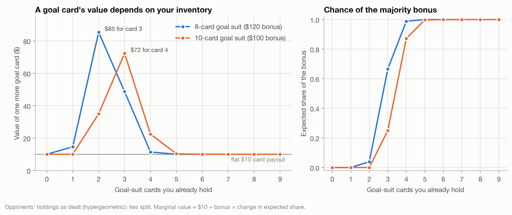
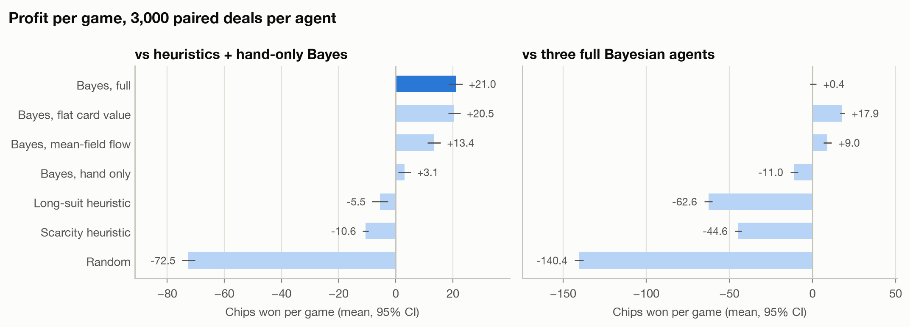
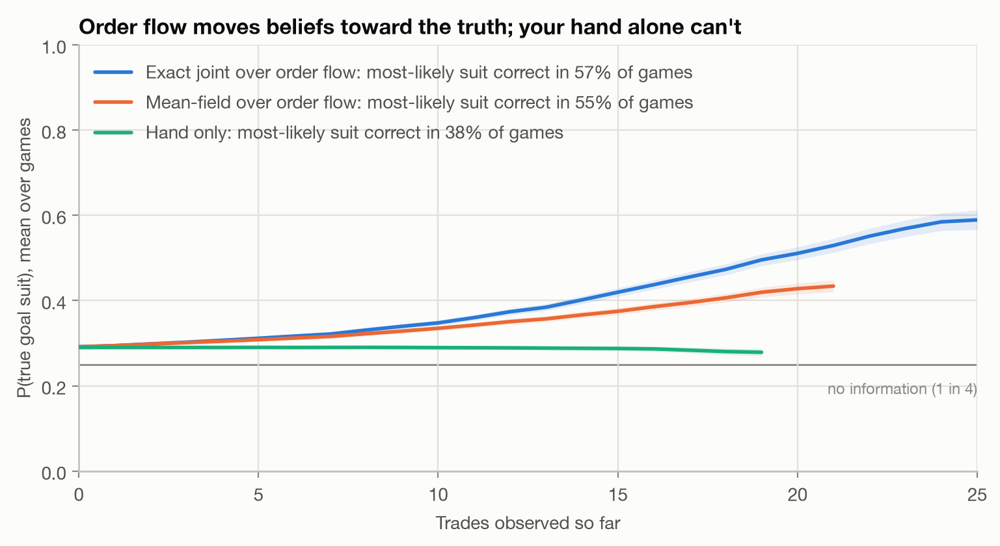
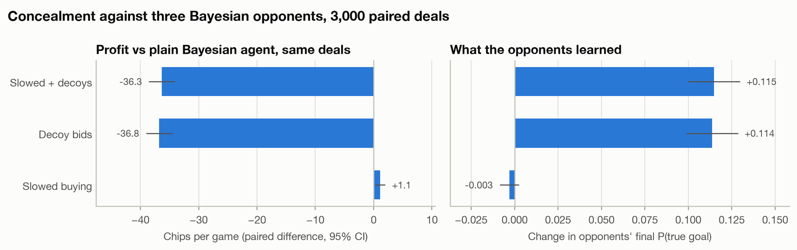

# Figgie: exact Bayesian inference and inventory-aware valuation

Across 3,000 paired deals against tuned heuristic players, an agent that runs exact
Bayesian inference over the 12 possible decks, using its own hand and every opponent's
order flow, makes **+$21.0 per game** [+18.6, +23.4]. It beats the best heuristic by
**$26.5 per game** [+23.7, +29.3] on the same deals.

Order flow accounts for most of that: the same agent using only its hand makes $17.9 less,
and names the goal suit correctly in 38% of games instead of 57%.

Two results went the other way from what I expected, and they turned out to be the more
interesting half of the project:

- the inventory-aware card valuation below is worth nothing against heuristic opponents,
  and *costs* $17.6 per game when every opponent uses it too;
- hiding what you believe from Bayesian opponents barely pays, and decoy bids backfire.



What a goal card is worth depends on what you already hold. With an 8-card goal
suit, the third card is worth $85, because it usually moves you into the lead for the
$120 bonus. The first card is worth $10, the second $15 and the fifth $11. A 10-card
suit peaks at $72 for the fourth card. The Bayesian agent quotes off this curve, weighted
by its posterior on which suit is the goal, so its bids move with its position. That
curve is exactly right for one player trading against opponents whose holdings stay put.
[Section 3](#3-why-the-inventory-aware-valuation-loses-to-a-flat-one) shows what happens
when every player trades off it.

---

## Results

All numbers are chips won per game, out of a $350 starting stack. One focal agent plays
against a fixed field of three opponents. Every row plays the **same 3,000 deals**: the
seed fixes the deck, the hands, the turn order and every seat's private randomness.
Differences are paired game by game. Brackets are 95% intervals.

### 1. Against tuned heuristics

The field is the long-suit heuristic, the scarcity heuristic and a hand-only Bayesian.

| Focal agent | Chips per game | vs full Bayes, same deals | Most-likely goal suit correct |
|---|---|---|---|
| **Bayes, full** | **+21.0** [+18.6, +23.4] | – | **57.1%** |
| Bayes, flat card value | +20.5 [+18.4, +22.7] | −0.4 [−2.5, +1.6] | 56.3% |
| Bayes, mean-field order flow | +13.4 [+11.1, +15.8] | −7.6 [−9.0, −6.1] | 54.7% |
| Bayes, hand only | +3.1 [+0.9, +5.3] | −17.9 [−19.9, −15.9] | 38.4% |
| Long-suit heuristic | −5.5 [−8.3, −2.7] | −26.5 [−29.3, −23.7] | – |
| Scarcity heuristic | −10.6 [−11.6, −9.5] | −31.6 [−33.8, −29.4] | – |
| Random | −72.5 [−74.8, −70.2] | −93.5 [−96.2, −90.9] | – |

Reading each Bayesian variant against the full agent:
- **Order flow is worth +$17.9** a game over hand-only inference.
- **Summing over the joint deal exactly is worth +$7.6** over treating opponents' hands
  as independent.
- **The inventory-aware valuation is worth nothing measurable** here (+$0.4).

### 2. Against three full Bayesian agents

| Focal agent | Chips per game | vs full Bayes, same deals | Most-likely goal suit correct |
|---|---|---|---|
| Bayes, full | +0.4 [−1.5, +2.3] | – | 68.1% |
| **Bayes, flat card value** | **+17.9** [+16.6, +19.3] | **+17.6** [+15.7, +19.4] | 64.4% |
| Bayes, mean-field order flow | +9.0 [+6.6, +11.5] | +8.6 [+6.5, +10.8] | 68.3% |
| Bayes, hand only | −11.0 [−13.3, −8.7] | −11.4 [−13.5, −9.3] | 38.4% |
| Scarcity heuristic | −44.6 [−46.7, −42.6] | −45.0 [−47.5, −42.5] | – |
| Long-suit heuristic | −62.6 [−65.1, −60.1] | −63.0 [−65.6, −60.3] | – |
| Random | −140.4 [−143.0, −137.7] | −140.8 [−143.6, −138.0] | – |

As a sanity check, a full Bayesian agent among three copies of itself makes +$0.4, which
is zero within noise, as symmetry requires.

The ranking flips here. A flat valuation (every goal card worth pot/n, $20 or $25) beats
the inventory-aware one by $17.6, and the mean-field agent also out-earns the exact one
even though the two call the goal suit equally well (68.3% vs 68.1%). Better beliefs don't
become chips once the valuation layer is the weak link.

The heuristics reorder too: scarcity loses less than long-suit, which chases the real goal
suit into Bayesian competition.



### 3. Why the inventory-aware valuation loses to a flat one

These are 300 of the same deals, broken down by `experiments/diagnose_valuation.py`. The
focal agent plays against three full Bayesian opponents. This is a tenth of the sample used
above and the table reports means with no intervals, so it is evidence about the shape of
the difference, not about its exact size.

| Focal agent | Goal cards bought | Goal cards sold | Net on other suits | Wins the majority bonus |
|---|---|---|---|---|
| Bayes, inventory-aware | 1.50 per game at $15.0 | 1.41 at $15.4 | −$5.6 | 46% of games |
| Bayes, flat value | 1.31 at **$8.1** | **1.84** at $14.1 | **+$22.7** | 11% |

The inventory-aware agent wins the bonus but pays for it. When all four players quote off
the marginal-value curve they compete for the same pivotal cards: it takes the majority in
46% of games, at $15 a goal card.

The flat agent mostly stops competing. It buys goal cards at half the price, sells more of
them to the players fighting over the majority, and makes $23 a game on the other suits.

What the curve misses is competition. It answers what a card is worth to me if nobody else
reacts, and the fix is to value a card in the game where opponents bid for the same
threshold. That is the same equilibrium rabbit hole as a level-1 opponent model, so I
stopped here.

I haven't isolated where the non-goal-suit profit comes from. It is measured, not
explained.

### 4. Order flow moves beliefs; your hand alone can't



With hand-only inference, belief in the true goal suit is fixed at the deal: 0.29 on
average, where 0.25 means no information. With order flow it climbs as trades print.
Against the heuristic field it ends the game at 0.47 with the exact joint and 0.39 with
mean-field. The curve stops at the trade count a quarter of games still reach, so the tail
isn't a biased handful of busy games.

The trade-count axis mixes two effects: it counts the agent's own trades as well as
everyone else's, and trades carry exact constraints (nobody can sell a card they don't
hold) on top of behavioural signal.

### 5. Hiding what you believe: no measurable leakage cost here

The hypothesis was that buying your goal suit loudly teaches Bayesian opponents what it
is, so an agent that conceals its beliefs should do better. Both variants play against
three full Bayesian opponents:
- **Slowed buying:** at most one buy every five turns in any suit it favours.
- **Decoy bids:** $6 bids in suits it thinks are unlikely to be the goal, averaging 8.7
  per game.

| Variant | Chips per game vs full Bayes, same deals | Change in opponents' final P(true goal) |
|---|---|---|
| Slowed buying | +1.1 [+0.2, +2.0] | −0.003 [−0.009, +0.003] |
| Decoy bids | −36.8 [−39.0, −34.5] | **+0.114** [+0.099, +0.129] |
| Slowed + decoys | −36.3 [−38.6, −34.1] | +0.115 [+0.100, +0.130] |

The data doesn't support that. Slowing down earns $1.1 a game on an interval that clears
zero, but this experiment makes about ten comparisons with no correction for multiplicity,
so a one-dollar effect at the edge of significance is not one I would defend. Either way
opponents end up exactly as well informed, so whatever the gain is, it isn't coming from
leaking less.

Decoys backfire outright. Bayesian opponents value unlikely suits at a dollar or two, so
they hit a $6 bid at once and the decoy agent ends up buying junk. Every one of those
trades is a hard constraint on someone's hand, which makes opponents *more* accurate
(+0.11), and the decoy agent itself too (76% vs 68%).

A decoy is only free if nobody fills it, and an order you never intend to be filled is a
spoof. The legitimate version of concealment, slowing down, was worth about a dollar.



---

## The game

Forty cards: one suit has 12, two have 10, one has 8. The goal suit is the same-colour
partner of the 12-card suit, so it has 8 or 10 cards. Four players are dealt ten cards
each and ante $50 into a $200 pot. They then trade single cards for four minutes. At the
end, each goal-suit card pays $10, and whoever holds the most goal cards takes the rest of
the pot ($120 or $100). Ties split it.

There are exactly **twelve deck configurations**. Pick the 12-card suit (4 ways); its
partner is the goal. Then the goal has 8 and the other two suits have 10, or the goal has
10 and the other two are 10 and 8 (2 ways).

## How it works

### Engine and the agent boundary

```
figgie/
  deck.py        configurations, the 286 possible 10-card suit counts, dealing
  market.py      one continuous double auction per suit: limit orders, cancels,
                 price-time priority, trades at the resting price, self-trade prevention
  protocol.py    the entire agent interface: Observation in, Action out, public events
  engine.py      turns, funding checks, settlement; owns every piece of hidden state
  inference.py   posterior over the 12 configurations (hand + order flow)
  valuation.py   majority-bonus share and the marginal value of a card
  agents/        random, two heuristics, Bayesian, concealing Bayesian
  tournament.py  paired-seed runs across processes, confidence intervals
experiments/     model fit, tuning, experiments, diagnostics, figures
```

An agent implements one method, `act(observation) -> action`. The observation holds only
your own current and dealt hands and chips, plus the attributed order books and the public
tape of placements, cancels and trades. It is a frozen dataclass, and the tape is a
read-only view. The deck configuration and other players' hands never cross the boundary.
A test walks every field of real observations and fails if anything else appears.

Four minutes of trading are split into 120 turns. Each turn every player acts once, in a
freshly shuffled order, so a game is a deterministic function of its seed. Resting orders
lock the chips or card behind them, so a resting order can always be filled.

### Inference

**Hand.** Your ten cards are a draw without replacement from a deck whose composition
depends on the configuration. P(hand | config) is a multivariate hypergeometric: twelve
exact numbers, normalised under a uniform prior. This already gives a distribution over
which suit is the goal *and* how many cards it has. Holding 5♠ 2♣ 2♥ 1♦ makes ♣ the goal
with probability 0.49 and ♦ only 0.19.

**Order flow.** Each placement by an opponent is a noisy signal about their dealt hand.
A **level-0 opponent model** turns it into a likelihood over the 286 hands they could
hold. The model assumes an opponent chooses which suit to bid on by softmax(β · P(goal = s
| their own hand)), and which suit to offer by the reverse. Bid price sharpens the choice,
and a fraction ε of placements are treated as noise. Trades also add hard, model-free
constraints: nobody can sell a card they don't hold.

**The joint deal, exactly.** Opponents' hands are not independent: all three come from
the same 30 unseen cards. Summing over the joint deal looks like 286² terms per
configuration. But the deal probability factorises as ∏ₛ rₛ! / (h_Bₛ! h_Cₛ! h_Dₛ!), so the
sum is a convolution over suit-count compositions. One `bincount` pairs two opponents
into a 20-card composition, and a lookup dots it with the third. That is about 1 ms per
update, and it matches brute-force enumeration to 1e-9 in the tests.

Treating opponents as independent instead (mean-field) is the obvious shortcut, and on
synthetic data it is badly wrong. On 1,500 placements drawn from the model itself, exact
inference put 0.997 on the true goal and mean-field put 0.63 (the scenario in
`test_mean_field_is_measurably_worse_than_the_exact_joint`). It also misses constraints:
two opponents who each sold six spades together prove spades is the 12-card suit, but
either one alone fits a 10-spade deck.

**Fitting the opponent model.** β and ε are maximum-likelihood estimates. Every placement
in 400 simulated games (35,720 placements) is scored against the placer's *true* dealt
hand, which only the harness knows after the game.

| Opponent model | Best fit | Information per placement vs uniform |
|---|---|---|
| "Bids on suits its own hand says are the goal" | β = 4, ε = 0.2 | **+0.076 bits** |
| "Bids on whatever it holds least of" | β = 0.1, ε = 0.7 | −0.034 bits (worse than uniform at every setting) |

The "bid what you hold least of" model is intuitive but wrong about this game. A long suit
is evidence that suit has 12 cards, which makes its *partner* the goal. Scarcity in your
hand says little about which suit is the goal.

### Valuation

If you hold k goal cards, your payout is 10k plus the bonus times your expected share of
it. That share is 1 if you hold strictly the most and 1/(t+1) if you tie with t others.
Opponents' holdings come from the posterior over their hands, conditioned on the exact
number of goal cards not in your hand.

The value of buying one card is $10 plus the bonus times the change in expected share,
assuming the card comes from an opponent in proportion to their holdings. The value of
selling one is the reverse. Under the dealing prior, buying from holdings is the same as
re-conditioning on one fewer card left for opponents (a tested identity). The expected
share over all deals comes to exactly 1/4 (also tested).

The **bid ceiling** for suit s is Σ over configurations with goal s of P(config) ×
marginal value. The **offer floor** is the same sum for losing a card.

All non-random agents share one execution layer: cancel quotes that have gone bad, take
anything priced better than value by at least $1, then quote at value minus or plus an
edge. So the agents differ only in what they believe cards are worth.

### Agents

| Agent | Beliefs | Card value |
|---|---|---|
| `random` | none | none (always-legal random orders) |
| `scarcity` | goal = suit dealt fewest of | flat, tuned |
| `long_suit` | goal = partner of suit dealt most of | flat, tuned |
| `bayes_hand_only` | exact hand posterior | inventory-aware |
| `bayes_mean_field` | hand + order flow, opponents independent | inventory-aware |
| `bayes_flat_value` | hand + order flow, exact joint | flat pot / n per goal card |
| `bayes` | hand + order flow, exact joint | inventory-aware |
| `conceal_*` | as `bayes`, plus slowed buying and/or decoy bids | inventory-aware |

The benchmarks are tuned so they aren't strawmen. Both heuristics' value parameters and the
Bayesian agent's minimum offer price were grid-searched on 1,500 paired games, using seeds
disjoint from evaluation. The field was two heuristics and a hand-only Bayesian.

- **Scarcity heuristic:** best at goal value $4, other suits $4. That's a nearly flat
  valuation, which makes it a cheap passive market maker. Trusting its goal pick more only
  loses more.
- **Long-suit heuristic:** best at goal value $12, other suits $4, an interior optimum.
  A goal value of $16 costs $11 a game.
- **Bayesian agent:** the minimum offer price plateaus from $6 to $10 (+$19.8 to +$20.6,
  inside each other's intervals). The grid's best, $10, is used.

The first sweep landed on the grid's edge for both heuristics, so the grid was widened
until the optimum was interior. The shared lesson from tuning is that not giving away
unwanted cards is worth more than being aggressive about the goal suit.

## Where I stopped, and why

- **Level-0 opponents.** The opponent model assumes other players act on their own hands
  and ignore everyone else's orders, which isn't true of the Bayesian agents. A level-1
  model, where opponents reason about what *you* have revealed, means simulating their
  posterior over your hand inside yours. I didn't build it. The leakage experiment found
  no measurable cost to revealing beliefs against these opponents, and more accurate
  beliefs didn't earn more against Bayesians (mean-field vs exact). Both suggest the next
  dollar is in valuation, not deeper opponent modelling.
- **Myopic valuation, and it matters.** Marginal value is computed at current holdings,
  as if opponents won't react. Section 3 shows that assumption costs $17.6 a game when
  everyone makes it. Valuing cards in equilibrium is the obvious next piece of work.
- **Price enters the likelihood as a sharpness multiplier.** It is not a generative model
  of prices.
- **Decoy bids are close to spoofing.** Resting bids you'd rather not have filled are
  illegal in real markets, and they lost money here anyway. "Slowed buying" is the
  legitimate version of concealment.
- **The market goes quiet early.** The median last trade is turn 16 of 120, only 2.5% of
  games trade after turn 60, and a game sees about 21 trades. Real Figgie sees far more
  trading in four minutes. Repeating the headline comparison at 60, 120 and 240 turns
  barely moves it (`experiments/horizon_check.py`: order flow worth $17.0-$17.8 at every
  horizon), but that is because the book is already quiescent, not because the result
  survives a livelier market. Each agent quotes one price per suit and requotes only when
  its valuation moves, which is what stalls trading.
- **Single-card orders; integer chips.** A bonus that can't split evenly gives its odd
  chips to tied winners in seat order. Seats rotate across seeds, so no seat is favoured.

## Tests

`pytest` runs 104 tests in about 10 seconds:

- **Conservation.** Cards and chips are conserved after *every* action of 20 random-agent
  games. Books are never crossed, and locked chips and cards always equal what the resting
  orders need.
- **Settlement.** Payouts always sum to exactly the pot, including three-way ties.
- **Matching.** Better price fills first. Earlier order fills first at equal price. Trades
  print at the resting price. Immediate-or-cancel orders never rest. Self-trade prevention
  works.
- **Engine/agent boundary.** Observations contain only whitelisted public types. Illegal
  actions are rejected. The same seed gives the same game.
- **Hand inference.** The hand likelihood matches scipy's multivariate hypergeometric and
  sums to 1 over all 286 hands. The posterior sums to 1, rules out impossible
  configurations, and is calibrated over 20,000 deals.
- **Order-flow inference.** The posterior converges to the true configuration on synthetic
  order flow. The convolution matches brute-force enumeration of the joint deal, for both
  posteriors and hand marginals. Mean-field is measurably worse. Selling constraints across
  opponents are exact. The truth is never ruled out in real games.
- **Valuation.** Expected share over all deals is 1/4. Buying from holdings matches
  re-conditioning. The marginal value curve is hump-shaped and lies between $10 and
  $10 + bonus.

## Reproduce

```bash
pip install -e ".[test]"
experiments/reproduce.sh
```

`experiments/reproduce.sh` runs, in order: tests, the opponent-model fit, benchmark
tuning, the three paired experiments (3,000 seeds each), the valuation diagnostic, the
horizon check and the figures. Results land in `results/*.json` and figures in `figures/`. On a 10-core laptop
the mixed-field experiment takes 2 minutes and the all-Bayesian field 12; the all-Bayesian
runs dominate the total.
